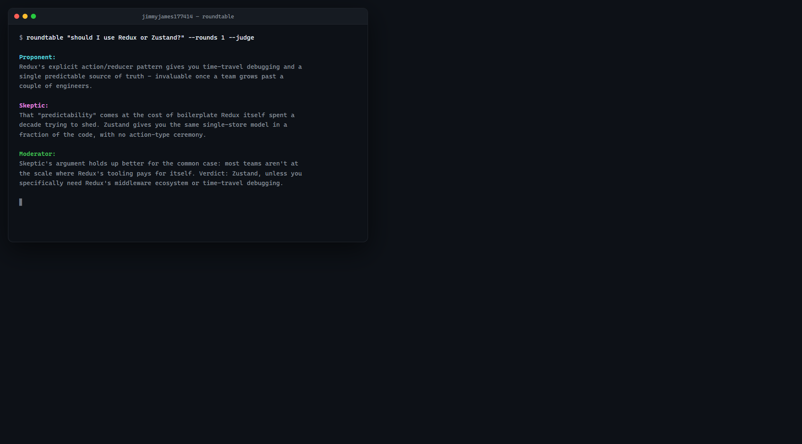

<p align="center">
  
</p>

<h1 align="center">claude-roundtable</h1>

<p align="center">
  Two Claude personas argue a topic adversarially, streamed live in your terminal.
</p>

<p align="center">
  <a href="https://github.com/jimmyjames177414/claude-roundtable/actions/workflows/ci.yml"></a>
  
  =18">
</p>

<p align="center">
  
  <br>
  <sub><i>Illustrative example output, styled for display - not a captured run. See "Example output" below for why, and how to get a real one.</i></sub>
</p>

It's a small, honest toy: a thin CLI over the Claude API that's fun to point at an
argument you can't settle.

## Quick start

```bash
npx github:jimmyjames177414/claude-roundtable "should I use Redux or Zustand?"
```

You'll need an Anthropic API key either way. Get one at
[console.anthropic.com](https://console.anthropic.com) and export it as
`ANTHROPIC_API_KEY`.

Or clone and run locally:

```bash
git clone https://github.com/jimmyjames177414/claude-roundtable.git
cd claude-roundtable
npm install
npm run build
export ANTHROPIC_API_KEY=sk-ant-...
node dist/index.js "should I use Redux or Zustand?" --judge
```

## Options

| Option | Default | Description |
|---|---|---|
| `--rounds <n>` | `3` | Number of exchanges per persona (each round is one turn for each side). |
| `--personas <a,b>` | `Proponent,Skeptic` | Two labels/stances, comma-separated. Exactly two. |
| `--judge` | off | After all rounds, a third "Moderator" persona reads the full transcript and renders a short, decisive verdict. |
| `--model <id>` | `claude-sonnet-5` | Override the Claude model id. Rejected with a clear error if it doesn't look like a real Claude model id. |
| `--fast` | off | Shorthand for the cheaper/faster `claude-haiku-4-5-20251001` model. Mutually exclusive with `--model`. |

## How it works

Each turn is one independent call to the Claude API: the persona's system prompt
establishes its name and stance and instructs it to directly rebut the other side's
most recent point in roughly 2-4 sentences, and the user message carries the topic plus
the transcript so far. Turns alternate strictly between the two personas for `--rounds`
exchanges each (`--rounds 3` means `A,B,A,B,A,B`), streamed token-by-token to stdout
with a distinct color per speaker (persona A cyan, persona B magenta, Moderator bold
green). With `--judge`, one final call hands the Moderator persona the complete
transcript and asks for a short, decisive verdict.

## Example output

No Anthropic API key was available in the environment this was built in, so the image
above is a styled mock-up of the real format rather than a captured run. Text version:

<details>
<summary>Show illustrative transcript</summary>

```
$ roundtable "should I use Redux or Zustand?" --rounds 1 --judge

Proponent:
Redux's explicit action/reducer pattern gives you time-travel debugging and a single
predictable source of truth - invaluable once a team grows past a couple of engineers.

Skeptic:
That "predictability" comes at the cost of boilerplate Redux itself spent a decade trying
to shed. Zustand gives you the same single-store model in a fraction of the code, with no
action-type ceremony.

Moderator:
Skeptic's argument holds up better for the common case: most teams aren't at the scale
where Redux's tooling pays for itself. Verdict: Zustand, unless you specifically need
Redux's middleware ecosystem or time-travel debugging.
```

</details>

Run it yourself with a real key and this section (and the image above) can be replaced
with an actual capture - PRs welcome.

## License

MIT

---

<p align="center"><sub>by <a href="https://github.com/jimmyjames177414">@jimmyjames177414</a></sub></p>
